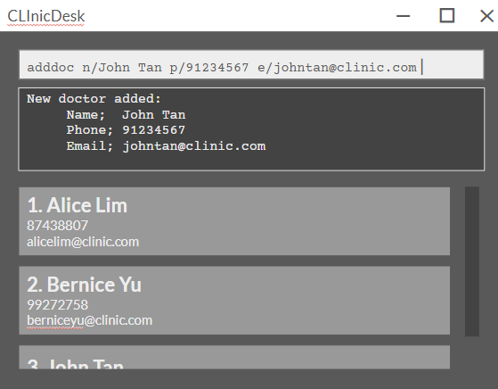

# CLInicDesk
ClinicDesk is a desktop app for clinic receptionists, to manage clinic 
contacts and appointments, optimized for use via Command Line Interface (CLI).

Example usages:
* Managing patient and doctor records
* Scheduling and tracking
* Quick CLI-based data entry

The project is based on AddressBook Level 3 (AB3).
* It is written in OOP fashion in Java
* Around 6 KLoC base, extended with clinic-specific 
  features
* For the User and Developer guides, see: **[CLInicDesk User and Developer guides ](https://ay2526s2-cs2103t-w12-1.github.io/tp/index.html)**.
*  For the detailed documentation of this project, see the **[CLInicDesk Product Website](https://ay2526s2-cs2103t-w12-1.github.io/tp/)**.
* This project is based on the AddressBook-Level3 project created by the [SE-EDU initiative](https://se-education.org)
